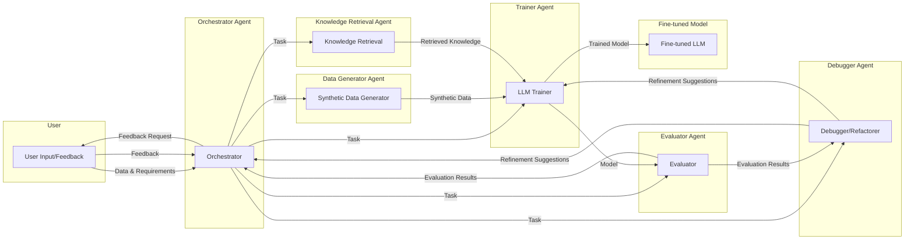

# LLM Fine-tuning Agent Execution Plan

**Architecture Diagram:**



**Tech Stack and Libraries:**

*   **Agent Framework:** `langgraph`
*   **LLM Models:** Hugging Face Transformers (LLAMA, QWEN, Deepseek, and others)
*   **Fine-tuning:** Hugging Face `trl` (for RLHF) and AutoTrain
*   **Data Handling:** `pandas` (for CSV/JSON processing)
*   **Evaluation:** Standard LLM evaluation libraries (e.g., `evaluate`, `rouge-score`, `bert-score`)
*   **Configuration:** Extend the existing JSON-based configuration.
* **Programming Language**: Python

**Execution Plan:**

1.  **Initialization:**
    *   Load configuration (extending `configs/default_config.json`).
    *   Initialize agents (Orchestrator, Data Generator, Knowledge Retrieval, Trainer, Evaluator, Debugger).
    *   Set up `langgraph` workflow.

2.  **User Input:**
    *   User provides:
        *   Model name (default: "meta-llama/Llama-2-7b-hf").
        *   Initial data samples (CSV or JSON).
        *   Task description/requirements.

3.  **Orchestration (Orchestrator Agent):**
    *   Receives user input.
    *   Determines the initial workflow based on user input (e.g., fine-tuning, RLHF, debugging).
    *   Delegates tasks to other agents.

4.  **Data Generation (Data Generator Agent - Optional):**
    *   If needed, generates synthetic data based on user-provided samples and requirements.
    *   Uses prompting techniques to create diverse and relevant training data.
    *   Uses the `curator` library to generate synthetic data.

5.  **Knowledge Retrieval (Knowledge Retrieval Agent - Optional):**
    *   If the task requires external knowledge, retrieves relevant information from external sources (e.g., web search, databases).

6.  **Training (Trainer Agent):**
    *   Performs fine-tuning using Hugging Face AutoTrain and `trl`.
    *   Handles different fine-tuning methods (supervised, RLHF).
    *   Uses data from user input, synthetic data (if generated), and retrieved knowledge (if applicable).
    *   Saves intermediate checkpoints.
    *   **Human-in-the-Loop:** Periodically prompts the user for feedback during training (e.g., "Training is 50% complete. Continue?").

7.  **Evaluation (Evaluator Agent):**
    *   Evaluates the fine-tuned model using standard metrics (BLEU, ROUGE, etc.) and potentially custom metrics.
    *   Generates evaluation reports.
    *   **Human-in-the-Loop:** Presents evaluation results to the user and asks for feedback (e.g., "The model achieved a BLEU score of X. Is this satisfactory?").

8.  **Debugging/Refactoring (Debugger Agent):**
    *   Analyzes evaluation results and identifies potential issues (e.g., overfitting, underfitting, bias).
    *   Suggests improvements to the training process, data, or model configuration.
    *   **Human-in-the-Loop:** Presents debugging suggestions to the user and asks for confirmation to apply changes.

9.  **Iteration:**
    *   The Orchestrator agent uses feedback from the Evaluator, Debugger, and the user to iterate on the fine-tuning process.
    *   This may involve generating more data, adjusting training parameters, or refining the model architecture.

10. **Final Model:**
    *   Once the user is satisfied with the evaluation results, the final fine-tuned model is saved.

**File Structure (Example):**

```
llmfinetune-agent/
├── __init__.py
├── config.py       # Configuration loading and management
├── data.py         # Data loading and preprocessing
├── trainer.py      # Fine-tuning logic (AutoTrain, TRL integration)
├── agents/
│   ├── __init__.py
│   ├── orchestrator.py
│   ├── data_generator.py
│   ├── knowledge_retrieval.py
│   ├── trainer_agent.py  # Wraps trainer.py functionality
│   ├── evaluator.py
│   ├── debugger.py
│   └── utils.py # Shared utility functions for agents
├── evaluation/
│    ├── __init__.py
│    └── metrics.py # Custom evaluation metrics if needed.
├── main.py         # Entry point for the agent
└── README.md
configs/
└── default_config.json  # Extended configuration file
requirements.txt
```

**Enhancements:**

*   **Interactive Dashboard:**  A web-based dashboard for visualizing the fine-tuning process, evaluation results, and agent interactions. This would greatly improve the user experience for non-programmers.
*   **Automated Model Selection:** Implement logic to recommend models based on task requirements and available resources.
*   **Advanced Debugging:** Incorporate more sophisticated debugging techniques, such as analyzing attention weights or using interpretability tools.
*   **Version Control:** Integrate with a version control system (like Git) to track changes to the model, data, and configuration.
